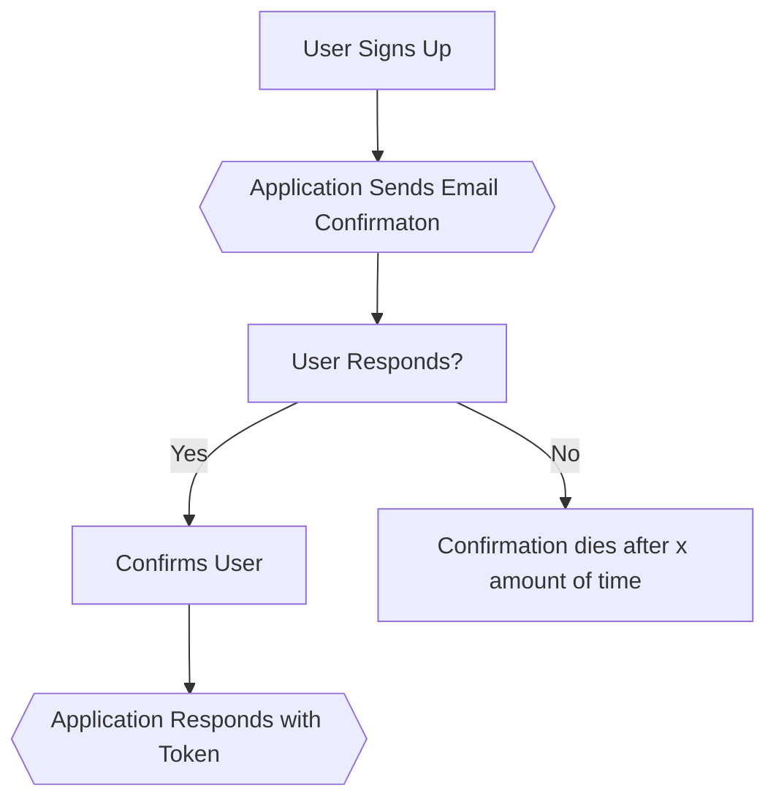

# API Routes

---

## Group

### Creating a Group

```http request
POST /group/<name>
```

Response:

200 Success

```json
{
  "uuid": 1,
  "name": "<name>",
  "created": "<timestamp>"
}
```

### Get Information About Group

```http request
GET /group/<id>
```

Response:

```json
{
  "uuid": 1,
  "name": "<name>",
  "created": "<date>"
}
```

### Update Group Name

```http request
PATCH /group/<id>/name
```

Request:

```json
{
  "name": "<name>"
}
```

### Delete Group

```http request
DELETE /group/<id>
```

### Adding Users to Group

```http request
POST /group/<id>/new_users
```

Request Data:

```json
{
  "users": [
    1,
    2,
    4
  ]
}
```

### Remove Users From Group

```http request
DELETE /group/<id>/delete_users
```

Request Data:

```json
{
  "users": [
    1,
    2,
    4
  ]
}
```

---

# User

#### Flow:



---

## User Signup

```http request
POST /user/signup
```

#### Request:

```json
{
  "username": "<username>",
  "password": "<password>",
  "email": "<email",
  "phone": "<phone>",
  "name": "<name>"
}
```

#### Response: 
```
(Sends an email to user)
```

---

## User Confirm

```http request
POST /user/signup-confirm
```
#### Request:
```json
{
  "link_id": "<link_id>"
}
```
#### Response:
```json
{
  "token": "<token>"
}
```

---

## User Sign In
```http request
POST /user/signin
```
#### Request:
```json
{
  "email": "<email>",
  "password": "<password>"
}
```
#### Response:
```json
{
  "token": "<token>"
}
```

---
## User Sign Out
```http request
DELETE /user/signout
```
#### Request:
```json
{
  "token": "<token>"
}
```
---
## User Forgot Password
```http request
POST /user/forgot
```
#### Request:
```json
{
  "email": "<email>"
}
```
#### Response:
```
(sends email)
```
---
# Ignore Everything Below
## User Forgot Password Confirm
```http request
POST /user/forgot-confirm
```
```json
{
  
}
```
POST /user/change-email
```

### Delete User

```
DELETE /user/delete
